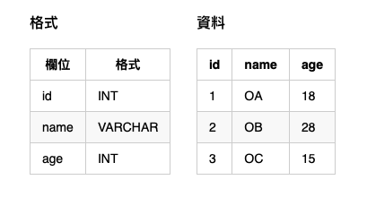

# delete

## 情境
### 資料庫


<!--
#### 格式
| 欄位 | 格式  |
|---|---|
| id | INT | 
| name | VARCHAR |
| age | INT |

#### 資料
| id | name | age |
|---|---|---|
| 1 | OA | 18 |
| 2 | OB | 28 |
| 3 | OC | 15 |
-->

### Model

```php
namespace M;

class User extends Model {}
```

## 單筆刪除
Model 物件可使用 `delete` method 將該筆資訊從資料庫刪除，刪除成功則回傳 **true**，失敗則回傳 **false**。

```php
$user = \M\User::one(2);
$result = $user->delete();

echo $result ? '刪除成功' : '刪除失敗';

$user = \M\User::one(2); // 重新抓一次資料，應該會為 null
echo $user ? '未刪除' : '已經成功刪除'; // 已經成功刪除
```

## 多筆刪除
有兩種方式，可採用 `deleteAll` 或者 `where 優先` 的方式來完成多筆刪除，成功即回傳 **true**，失敗則 **false**，通常會以 `where 優先` 的方式為主要寫法。

* deleteAll 方式，第一參數開始即為條件。
* where 優先，則是先下好 where 條件後，在 delete 符合條件的資料。

```php
// deleteAll 的方式
$result = \M\User::deleteAll('id > ?', 1);
echo $result ? '刪除成功' : '刪除失敗';

$total = \M\User::count(); // 取得所有數量
echo $total; // 1

// where 優先的方式
$result = \M\User::where('id > ?', 1)->delete();
echo $result ? '刪除成功' : '刪除失敗';

$total = \M\User::count(); // 取得所有數量
echo $total; // 1
```

## 刪除之後
此功能只給 **單筆刪除** 使用！

如果每次刪除一筆 User 資料時，就要將其他資料也一並刪除，那就可以在 `afterDeletes` 內指定一個刪除完後需要做的 method，如果 `afterDeletes` 中若有一個回傳不是為 true，那此次刪除就會是失敗的，該 delete 即回傳 **false**。

通常這類功能可以用在 **計數** 功能的欄位上。

```php
// 定義 Model
class User extends Model {
  static $afterDeletes = ['clean'];

  public function clean() {
    User::deleteAll();
    return true;
  }
}

// 新增一筆
$user = \M\User::one(2);
$result = $user->delete();

if ($result) { // 刪除成功
  echo \M\User::count(); // 0
}
```
