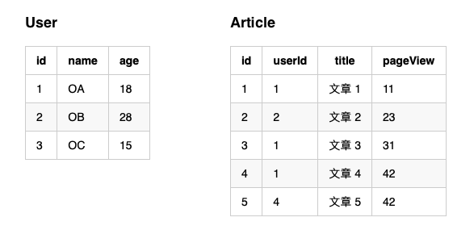
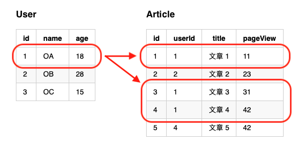
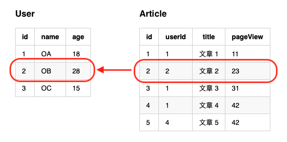
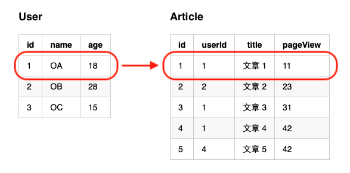
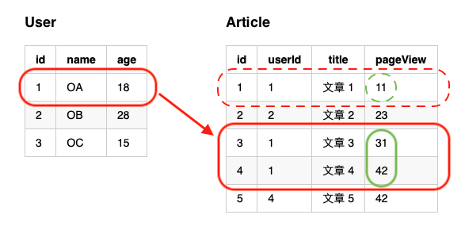

# relation
關聯

## 情境
### 資料庫


<!--
### User
| id | name | age |
|---|---|---|
| 1 | OA | 18 |
| 2 | OB | 28 |
| 3 | OC | 15 |

### Article
| id | userId | title | pageView |
|---|---|-------|-----------|
| 1 | 1 | 文章 1 | 11 |
| 2 | 2 | 文章 2 | 23 |
| 3 | 1 | 文章 3 | 31 |
| 4 | 1 | 文章 4 | 42 |
| 5 | 4 | 文章 5 | 42 |
-->

### Model

```php
namespace M;

class User extends Model {}

class Article extends Model {}
```

## hasMany
因為關聯式資料庫經常需要做資料關聯，時常遇到 `一對一` 或 `一對多` 甚至 `多對多` 的關聯模式，而此系統也提供了方便的關聯方式。

以下範例，單筆 `User`，需要取出其所屬的 `Article` 情境：



```php
$user = \M\User::one(1);
$articles = \M\Article::all('userId = ?', $user->id);

foreach ($articles as $article) {
  echo $article->title;
  // 依序會印出 "文章 1"、"文章 3"、"文章 4"
}

$user = \M\User::one(3);
$articles = \M\Article::all('userId = ?', $user->id);
echo count($articles); // 0
```

但若使用了 `hasMany` 關聯方式，則會簡潔許多！

方式就是在 `User Model` 內新增一組 `$relations`，如下範例：

```php
class User extends Model {
  static $relations = [
    'articles' => ['hasMany' => 'Article']
  ];
}
```

上例 `User Model` 內建立一組**關聯** `'articles' => ['hasMany' => 'Article']`，語意就是 `User` 有著**多筆**的關聯，單筆 `User` 對應著多筆的 `Article`。

其 key 為 `articles`，關聯方式為 `hasMany`，`Model` 為 `Article`，此模式為**一對多**。

由於資料表 `Article` 中有 `userId` 外鍵作為與 `User` 的 `id` 主鍵做關聯，系統就會依據你的 `User` 內的 `$relations` 設定值自動建立關聯，用法如下：

```php
$user = \M\User::one(1);
foreach ($user->articles as $article) {
  echo $article->title;
  // 依序會印出 "文章 1"、"文章 3"、"文章 4"
}

$user = \M\User::one(3);
echo count($user->articles); // 0
```

## belongToOne
`belongToOne` 的思維就與 `hasMany` 相反，`belongToOne` 則是在 `Article` 角度思考，單筆 `Article` 資料，取得其所屬的 `User`。

以下範例，單筆 `Article`，需要取出其所屬的 `User` 情境：



```php
$article = \M\Article::one(2);
$user = \M\User::one('id = ?', $article->userId);
echo $user->name; // OB

$article = \M\Article::one(5);
$user = \M\User::one('id = ?', $article->userId);
var_dump($user); // null
```

但若使用了 `belongToOne` 關聯方式，會簡潔許多，方式就是在 `Article Model` 內新增一組 `$relations`，如下範例：

```php
class Article extends Model {
  static $relations = [
    'user' => ['belongToOne' => 'User']
  ];
}
```

`Article Model` 內建立一組**關聯** `'user' => ['belongToOne' => 'User']`，語意就是 `Article` 有著**單筆**的關聯，單筆 `Article` 對應著單筆的 `User`。

其 key 為 `user`，關聯方式為 `belongToOne`，`Model` 為 `User`，此模式為屬於模式**一對一**。

由於資料表 `Article` 中有 `userId` 外鍵作為與 `User` 的 `id` 主鍵做關聯，系統就會依據你的 `Article` 內的 `$relations` 設定值自動建立關聯，用法如下：

```php
$article = \M\Article::one(2);
echo $article->user->name; // OB

$article = \M\Article::one(5);
var_dump($article->user); // null
```

> `hasMany` 是一對多模式，故取出來的的值會是**多筆**的，所以是回傳 **Model 陣列**，若找不到任何資料則回 **空陣列**
> 
> 反之 `belongToOne` 是屬於某一筆資料，所以回傳結果會是 **Model 物件**，若找不到關聯則回傳 **null**


## hasOne
有 `hasMany` 就會有 `hasOne`，其邏輯與 `hasMany` 相似，差別是回傳結果會不同而已，`hasMany` 是回傳 **陣列**，而 `hasOne` 則是 **物件**。

`hasOne` 簡單說就是 `hasMany` 的第一筆資料，若 `hasMany` 結果為空陣列，那 `hasOne` 結果必為 **null**

`User Model` 中新增 `'article' => ['hasOne' => 'Article']` 的 `$relations` 就可以使用 `hasOne`。



```php
class User extends Model {
  static $relations = [
    'article' => ['hasOne' => 'Article']
  ];
}

$user = \M\User::one(1);
echo $user->article->title; // 文章 1

$user = \M\User::one(3);
var_dump($user->article); // null
```

## 條件關聯
`$relations` 內的組合可以依據需求做設定，例如說單筆 `User` 下，可以有多筆 `Article`，故可以使用 `$user->articles` 取得所屬的 `Article`，但專案開發中往往需要其他條件。

例如需要取得該 `User` 下 `pageView` 超過 **20** 的 `Article`，在關聯模式下該如何做？

可在 `User Model` 內新增一組 `'pv20Articles' => ['hasMany' => 'Article', 'where' => ['pageView > ?', 20]]` 的 `$relations` 如此就可符合此需求的設定。

如下範例，可以得知 `$relations` 內不止是可以設定關聯，亦可以附加其他查詢條件，此次取出的 `Article` 就會符合 `pageView` 大於 20 的結果。



```php
class User extends Model {
  static $relations = [
    'pv20Articles' => ['hasMany' => 'Article', 'where' => ['pageView > ?', 20]]
  ];
}

$user = \M\User::one(1);
foreach ($user->pv20Articles as $pv20Article) {
  echo $pv20Article->title;
  // 依序會印出 ""文章 3"、"文章 4"
}
```

## 關聯鍵
上述的 `hasMany`、`hasOne` 以及 `belongToOne` 系統之所以可以自動關聯起來，主要是因為命名規則的統一。

如 `Article` 內有 `userId` 當外鍵，對應著 `User` 的 `id` 主鍵，所以可以自動的關聯起來，其完整的寫法應該是如下：

```php
class User extends Model {
  static $relations = [
    'articles' => ['hasMany' => 'Article', 'primary' => 'id', 'foreign' => 'userId']
  ];
}

class Article extends Model {
  static $relations = [
    'user' => ['belongToOne' => 'User', 'primary' => 'id', 'foreign' => 'userId']
  ];
}
```

因為命名有符合 `駝峰式命名（CASE_CAMEL）` 所以系統允許可以不必每次都填寫 `primary` 與 `foreign` 的設定值，除非您的資料庫欄位名稱因為專案需求無法符合命名規則，那就必須定義清楚 `primary` 與 `foreign` 欄位。

## 簡寫

範例中的 `$relations` 都是完整且工整的寫法，而在此系統中，也提供了簡寫如下：

```php
class User extends Model {
  static $relations = [
    'articles' => '<= Article'
  ];
}

class Article extends Model {
  static $relations = [
    'user' => '-> User'
  ];
}
```

在沒有其他附加條件需求下，可以採用簡寫方式，如果有其他如 `where` 條件之下，依然需使用完整的寫法。

簡寫符號中的 `<=` 代表著 `User` **<=** `Article` 也就是 `單筆 User` 擁有著 `多筆 Article`。

簡寫符號中的 `->` 代表著 `Article` **->** `User` 也就是 `單筆 Article` 屬於 `單筆 User`。

依照以上邏輯推理，`hasOne` 的簡寫方式則為：

```php
class User extends Model {
  static $relations = [
    'article' => '<- Article'
  ];
}
```

簡寫符號中的 `<-` 代表著 `User` **<-** `Article` 也就是 `單筆 User` 擁有著 `單筆 Article`。

通常在專案開發上，由於最常使用到的關聯是 `hasMany`，所以系統更可以針對 `hasMany` 簡寫如下：

```php
class User extends Model {
  static $relations = [
    'article' => 'Article'
  ];
}
```

若連關聯符號也省去，則代表使用 `hasMany` 的簡寫方式。

## 取得關聯條件

上面 **條件關聯** 的範例中，需要取得單筆 `User` 下 `pageView` 超過 **20** 的 `Article`，在 **條件關聯** 中示範了在 `$relations` 新增一組條件式的關聯方法解決此問題。

但若不想新增 `pv20Articles` 的情況下，其實也有方式可以解決此問題。

隨著專案開發，可能會產生多組的 `$relations`，即便沒被共用的也會新增上去，如此一來可能會造成專案管理的困擾，所以可以用以下方式改善此問題：

```php
class User extends Model {
  static $relations = [
    'articles' => ['hasMany' => 'Article']
  ];
}
```

在 `User` 內先只新增一組 `$relations`，接者再使用 `relation` 函式指定 `$relations` 要關聯的 key，即可取得該關聯的條件，範例如下：

```php
$user = \M\User::one(1);

$articleWhere = $user->relation('articles');
$articleWhere->and('pageView > ?', 20);

$articles = $articleWhere->all();

foreach ($articles as $article) {
  echo $article->title;
  // 依序會印出 "文章 3"、"文章 4"
}
```

上面範例中，可以藉由 `$user->relation('articles');` 取得已經被關聯好的 `Article Where`，接著針對此 `Where` 做其他條件，直到最後的 `->all()` 即可以取得所需的資料。

當然最後也可以使用 `->one()` 來取得單筆資料。

`relation` 函式其實就是把 `$relations` 該組關聯的條件取出，並且回傳該 `Model Where`，所以可以讓開發者持續對此 `Model Where` 做條件的設定，待完成條件設定後再依據需求下查詢方法。

