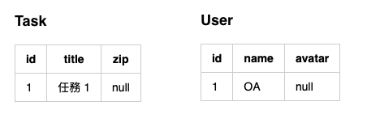

# uploader
上傳器

## 情境
### 資料庫



<!--
### Task
| id | title | zip |
|---|---|---|
| 1 | 任務 1 | null |

### User
| id | name | avatar |
|---|---|---|
| 1 | OA | null |
-->

### Model

```php
namespace M;

class Task extends Model {}

class User extends Model {}
```

## 上傳器
**上傳器** 是一項特殊 Plugin 功能，可以指定資料表中的特定欄位為上傳器，以情境例子來看，`Task` 中的 `zip` 欄位主要用來記錄檔案位置。

例如在特定的需求下，需要紀錄 **任務 1** 綁定某一個檔案，如下例子：

```php
$task = \M\Task::one(1);

// 綁定檔案
$task->zip->put('/path/.../demo.zip');

// 更新
$task->save();

// 取得檔案網址
echo $task->zip->url(); // http://.../md5code.zip
```

如此可以做到便捷的綁定檔案與取得檔案網址功能。

要實作此上傳器就需在該 Model 下指定欄位，如下範例：

```php
class Task extends Model {}

Task::uploader('zip', 'File');
```

在該 Model 下方設定指定綁定的欄位與型態，目前可用型態有 `File`、`Image`。

## 檔案上傳器

當在 `Task Model` 下設定 `zip` 欄位為 **檔案上傳器** 後，就可以來使用此功能了！

上傳器可以接收的格式有 `$_FILES`、`url`、`file` 三種格式。

在 `put` 完成後會回傳 `bool` 格式的結果，成功為 `true`，失敗為 `false`

```php
$task = \M\Task::one(1);

// file 檔案方式
$task->zip->put('/path/.../demo.zip');

// POST FILE 檔案方式
$task->zip->put($_FILES['demo']);

// POST FILE 檔案方式
$task->zip->put('http://.../demo.zip');
```

## 儲存位置

當按儲存的方式有兩種，分別為 `Local` 與 `S3` 的儲存方式，可使用 `\M\Model::setUploader` 來設定所有上傳器的 `driver`。

```php
\M\Model::setUploader(function($uploader) {
  $uploader->driver('Local', ['dir' => PATH]);
});
```

也可以各別設定

```php
class Task extends Model {}

Task::uploader('zip', 'File')
    ->driver('Local', ['dir' => PATH]);
```

詳細設定可以參考 [初始設定](00_config.md)。

## 儲存路徑

路徑預設為 `/`**RootDirs**`/`**資料表名稱**`/`**欄位名稱**`/`**id 轉 36進位 前四位數**`/`**id 轉 36進位 後四位數**`/`**檔案 md5**`.`**副檔名**

* RootDirs 與 `driver` 的設定方式相同，可由 `\M\Model::setUploader` 設定或依據各個 `Model` 需求設定。
* id 轉 36進位 主要是為了簡短網址降低空間目錄過多的負擔而做。
* 檔案名稱會依據該次的檔案內容做 md5，以搭配前端網址的 CND cache。

以上例的情境 RootDirs 若為 `Storage`，id 為 1，轉為 36 則為 1，儲存位置就會是如下：

```path
/Storage/Task/zip/0000/0001/fe01ce2a7fbac8fafaed7c982a04e229.zip
```

若 id 為 48，轉為 36 則為 1c，儲存位置就會是如下：

```path
/Storage/Task/zip/0000/001c/fe01ce2a7fbac8fafaed7c982a04e229.zip
```

## 網址

### 網址
綁定過後的資料可以使用 `->url()` 來取得該檔案網址。

```php
$task = \M\Task::one(1);

$task->zip->put($_FILES['demo']);

$task->save();

echo $task->zip->url();
// http://demo.url/Storage/Task/zip/0000/0001/fe01ce2a7fbac8fafaed7c982a04e229.zip
```

### 預設網址

若是該筆檔案未有綁定過檔案，需要給予一個 **預設網址**，則可以使用 `default` 函式設定，其設定方式與 **儲存位置**、**儲存路徑** 方法相同，可由 `\M\Model::setUploader` 設定或依據各個 `Model` 需求設定。

假設設定 `$uploader->default('http://demo.url/demo.zip');` 時，`Task` 的 `zip` 欄位為 `null` 或為 `空` 時，就會以預設網址當網址的回傳字串。

```php
$task = \M\Task::one(1);

echo $task->zip->url();
// http://demo.url/demo.zip
```

## 圖片上傳器

**圖片上傳器** 與 **檔案上傳器** 功能相似，差別就是圖片上傳器可以預先裁切出需要的圖片大小，並且可以分別取得各自的網址。

設定方式也與檔案上傳器方式相同，於 `Model` 後設定即可。

```php
class User extends Model {}

User::uploader('avatar', 'Image');
```

圖片上傳器可以接收的格式也是 `$_FILES`、`url`、`file` 三種格式，而儲存類型也是有 `Local` 與 `S3` 兩種方式。

圖片上傳器可以指定圖片裁切版本，如下：

```php
class User extends Model {}

User::uploader('avatar', 'Image')
    ->version('rotate', 'rotate', [45]);
```

經過設定後的上傳器，在綁定圖片時，也會依據設定 `version` 製作不同的圖片

```php
$user = \M\User::one(1);

$user->avatar->put($_FILES['avatar']);

$user->save();

// 取得原始圖檔
echo $user->avatar->url();
// http://demo.url/Storage/User/avatar/0000/0001/fe01ce2a7fbac8fafaed7c982a04e229.png

// 取得選轉 45度 圖檔
echo $user->avatar->url('rotate');
// http://demo.url/Storage/User/avatar/0000/0001/rotate_fe01ce2a7fbac8fafaed7c982a04e229.png
```

圖片縮圖裁切功能，需由 `\M\Model::thumbnail` 設定採用哪些縮圖工具，相關設定可以參考 [初始設定](00_config.md)。

本專案內已有提供了 `Gd` 與 `Imagick` 兩種縮圖工具。

### 縮圖版本說明
`version` 一共有三個參數需要放置，依序如下：

* key - 用來識別版本的關鍵字串
* thumbnail - 縮圖工具的方法
* params - 縮圖時需帶入的參數

由於 version 版本不同，就可以在 `->url()` 時帶入不同的 `key`，如此就可以取得各自的版本網址。
